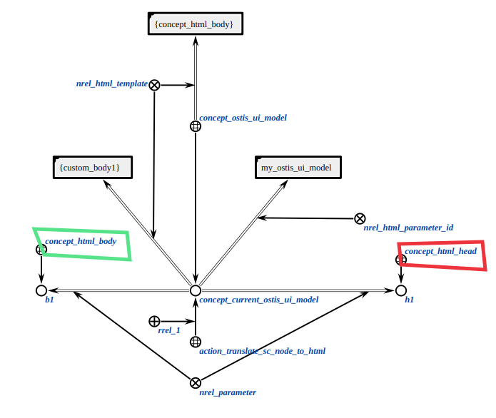
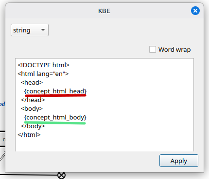
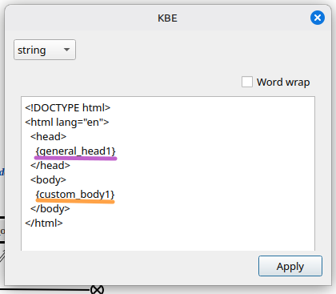
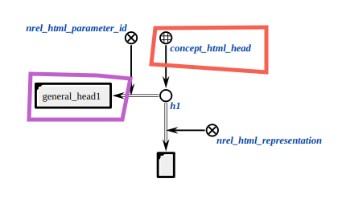
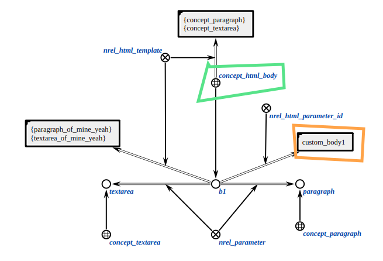
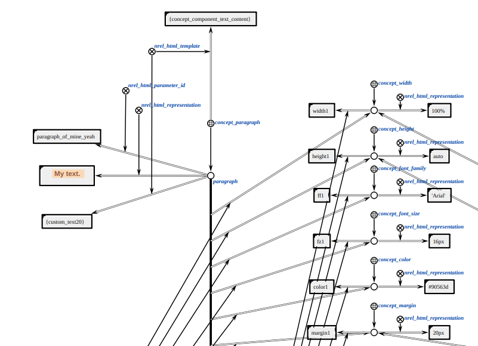
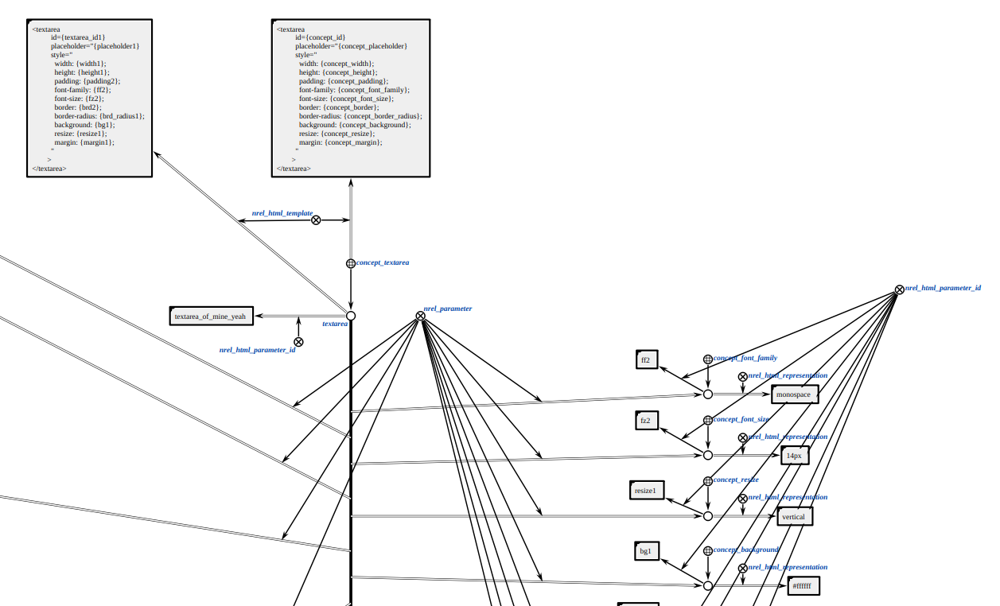

# Installation & Build

## ostis-ui

#### 1. Setup venv and conan

The project uses Conan to manage dependencies. 
Create venv, activate it and install conan.

```bash
python3 -m venv .venv
source .venv/bin/activate
pip3 install conan
```
#### 2. Clone Repository

First, clone the repository containing the ostis-ui:

```bash
git clone git@github.com:Glentas/ostis-ui.git
cd ostis-ui
git checkout demo
```

#### 3. Install Dependencies with Conan

Conan stuff can be found in ```/home/<your_pc_name>/.conan2/```.

Sc-machine files can be found in: 
```/home/<your_pc_name>/.conan2/p/sc-<something-something>/es/```.

Perform all commands below:

```bash
conan profile detect
conan remote add ostis-ai https://conan.ostis.net/artifactory/api/conan/ostis-ai-library
```

```bash
conan install . -s build_type=Release --build=missing
```

```bash
conan install . -s build_type=Debug --build=missing
```
#### 4. Configure Project

You can configure the project using CMake presets. 


After you installed all dependencies there are three main configuration options:
- Debug with tests:
  
  ```sh
  cmake --preset debug-conan
  ```

- Release:
  
  ```sh
  cmake --preset release-conan
  ```

- Release with tests:
  
  ```sh
  cmake --preset release-with-tests-conan
  ```

#### 5. Build Project

After configuring, you can build the project:

For debug build:

```sh
cmake --build --preset debug
```

For release build:

```sh
cmake --build --preset release
```

## sc-machine

#### 1. Download and extract

Download [GitHub Releases](https://github.com/ostis-ai/sc-machine/releases) and extract them to a location of your choice.

#### 2. Build KB

Go to ```/path/to/extracted/machine/sc-machine-0.10.5-Linux/bin/```.

Build KB:

```bash
./sc-builder --input /path/to/folder/with/kb/files/ --output /path/to/kb.bin --clear
```

- ```/path/to/folder/with/kb/files/``` - folder that contains your gwf's and scs's.
- ```/path/to/kb.bin``` - location where KB will be saved. You may change it's name: kb1.bin, my_kb.bin, etc.

#### 3. Start sc-machine

```bash
./sc-machine -s /path/to/kb.bin -e /path/to/ui_libs/build/Release/lib/
```

- ```/path/to/ui_libs/build/Release/lib/``` - location with dynamic ostis-ui libs. Library name is ```libostis-ui-html-translator.so```.

# Whole idea behind this realisation

## Recursive realisation of ui components

Let's think of each UI component as of self-sustainable component. Which means that button, whole div container, whole ui html document, script with javascript code or single color value (#000022) for some paragraph are equal and have the same structure.

This idea leads to following parameters that can be given to our html component:
1. html representation of this specific component:
 - color: #23aab2, 
 - paragraph:
``` html
<p 
style="
    width: 100%;
    height: auto;
    color: #90563d;
    font-size: 16px;
    font-family: 'Arial';
    text-align: center;
    background-color: #fbd9b7;
    padding: 20px;
    margin: 20px;
    line-height: 1.5;
    font-weight: 600;
    text-shadow: 1px 1px 2px #dd622d;
    border: 4px solid #d8a269;
    border-radius: 10px;
">
My text.
</p>
```
- etc.

2. template for this component:
- color: {some_color},
- paragraph:
``` html
<p style="
    width: {width1};
    height: {height1};
    color: {color1};
    font-size: {fz1};
    font-family: {ff1};
    text-align: {text_al1};
    background-color: {bg_color1};
    padding: {padding1};
    margin: {margin1};
    line-height: {ln_height1};
    font-weight: {fn_weight1};
    text-shadow: {text_shadow1};
    border: {border1};
    border-radius: {brd_radius1};
">
{custom_text20}
</p>
```
- etc.

With that you can insert any text instead of brackets.

## SCg realisation

**IN THIS REALISATION: IF ANY COMPONENT ALREADY HAS HTML REPRESENTATION WE DO NOT LAUNCH RECURSION WE RETURN FOUND HTML CODE.**

We start from general model for whole UI, our whole html document. This node - concept_current_ostis_ui_model - is given as parameter to agent.



From class template we get names of classes (concept_html_head, concept_html_body). 
These classes contain our nested components. 
Using that we can search for b1 and h1.

*Class template*


*Component template*


These b1 and h1 have their ids: general_head1, custom_body1. 
Using that we can map: general_head1 - h1, custom_body1 - b1.
And now we know that html code for head goes into {general_head1}, and html code for body in {custom_body1}.
After we recieve html code we create html representation node for this component.





After that we recursively launch agents for b1 and h1.
These agents recursively search and insert values in corresponding positions.



